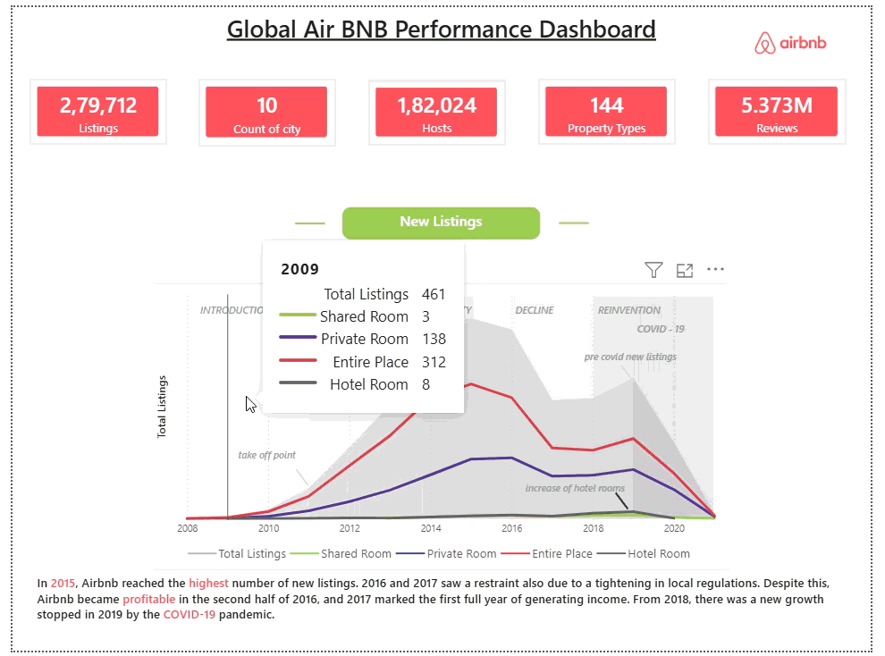
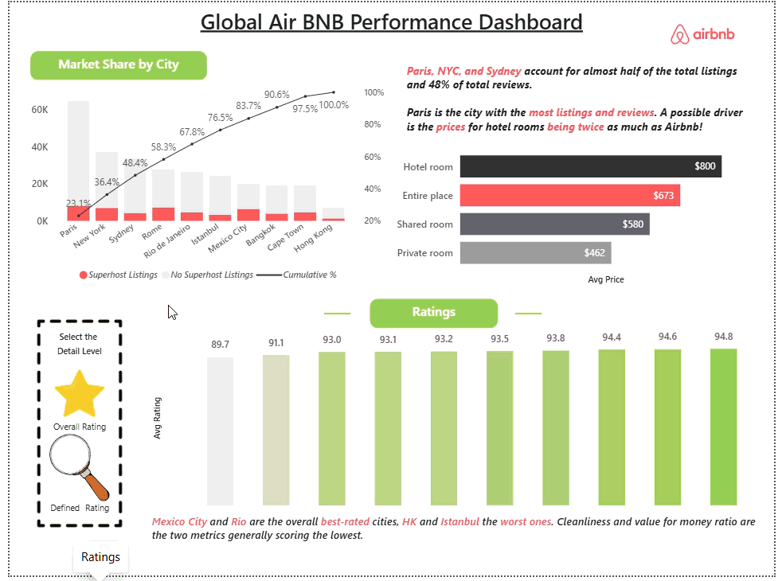
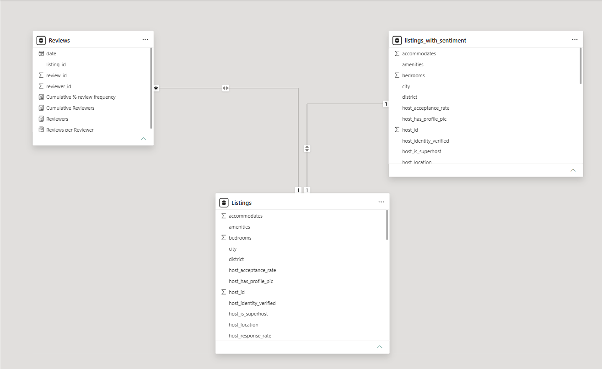

# 🌍 Global Airbnb Performance & Sentiment Analysis Dashboard | Power BI

## 📌 Project Overview

The **Global Airbnb Performance Dashboard** is a Power BI analytics project designed to uncover business insights from Airbnb listings, hosts, reviews, and customer behavior across multiple cities worldwide.

This dashboard helps stakeholders understand:

- How Airbnb listings evolved over time
- Which property types dominate the platform
- Customer engagement and review behavior
- Host trust & verification patterns
- Seasonal demand trends and market performance
- **Customer sentiment patterns across 2,79,712 reviews** *(new in dev branch)*

The project transforms raw Airbnb data into an interactive decision-making tool for identifying growth opportunities, customer trends, and operational risks.

---

## 🎯 Problem Statement

Airbnb operates across multiple cities with thousands of listings, hosts, and reviews, making it difficult to:

- Track platform growth over time
- Understand customer engagement and **sentiment** patterns
- Analyze trust and verification of hosts
- Identify seasonal demand fluctuations
- Compare performance across property types and cities
- **Detect declining sentiment trends before they impact revenue**

Without centralized analytics, business teams may struggle to make data-driven decisions regarding expansion, pricing strategy, customer trust, and host performance.

---

## ✅ Solution

This Power BI dashboard provides a centralized analytical view of Airbnb platform performance by:

- Visualizing listing growth trends
- Tracking review frequency, customer engagement, and **sentiment scores**
- Evaluating host verification and trust signals
- Identifying seasonal demand patterns
- Comparing room types and city-level performance
- **Surfacing sentiment breakdowns (positive / neutral / negative) by room type and time period**

The dashboard enables faster strategic decisions using interactive visuals and KPI-driven insights.

---

## 🛠 Tech Stack

| Tool | Purpose |
|------|---------|
| **Power BI** | Dashboard development & data visualization |
| **Python (pandas)** | Sentiment classification & data preprocessing |
| **DAX** | KPI calculations, measures, and business logic |
| **Data Modeling** | Relationship building, schema optimization |
| **Power Query** | Data cleaning and transformation |
| **Excel / CSV** | Source data handling |

---

## 📂 Data Source

**Dataset:** Airbnb Listings & Reviews – Maven Analytics

Sourced from [Maven Analytics Data Playground](https://www.mavenanalytics.io/data-playground). The dataset includes:

- Listings information
- Host details
- Review data (2,79,712 reviews analyzed for sentiment)
- Property types
- Geographic and seasonal trends

---

## ✨ Feature Highlights

### 📊 Business Problems Addressed

- Platform growth tracking
- Customer engagement and sentiment analysis
- Host credibility assessment
- Demand seasonality understanding
- Property performance comparison
- **Revenue risk quantification from negative sentiment**

### 📈 Key Visuals Included

**KPI Cards**
- Total Listings · Total Hosts · Property Types · Total Reviews · Cities Covered
- **Net Sentiment Score · Positive / Neutral / Negative Sentiment Counts**

**Trend Analysis**
- Listing growth over time
- Room-type performance trends
- **Positive sentiment trend (2013–2022)**

**Customer Behavior & Sentiment Analysis**
- Review frequency distribution
- Repeat reviewer patterns
- **Sentiment breakdown by room type (Entire Place, Private Room, Shared Room)**
- **Neutral reviewer identification for conversion targeting**

**Trust & Verification Analysis**
- Host verification insights
- Trust signal evaluation

**Seasonality Analysis**
- Monthly demand trends
- Geographic demand comparison

---

## 🧠 Sentiment Analysis Report

> **Scope:** 2,79,712 reviews analyzed across all cities and room types.

---

### ⚙️ How Sentiment & Net Sentiment Score Were Calculated

Since the Airbnb dataset used in this project **does not contain textual review comments**, traditional NLP-based sentiment analysis (e.g. VADER, TextBlob) was not applicable.

Instead, a **score-based sentiment classification** approach was used, leveraging the `review_scores_rating` column from `Listings.csv`. This column stores an aggregated guest satisfaction score **out of 100** for each listing.

Each listing was classified into one of three sentiment categories using the following thresholds:

| Sentiment | Condition | Interpretation |
|-----------|-----------|----------------|
| ✅ Positive | review_scores_rating ≥ 90 | Guest had a great experience |
| ⚠️ Neutral | review_scores_rating between 70 and 89 | Guest had an average experience |
| ❌ Negative | review_scores_rating < 70 | Guest had a poor experience |

These thresholds were chosen based on industry-standard customer satisfaction benchmarks, where scores above 90% indicate high satisfaction and scores below 70% signal significant dissatisfaction.

This classification was performed using **Python (pandas)** via the `sentiment.py` script included in this repository. The output was saved as `listings_with_sentiment.csv` and imported into **Power BI** to power the Sentiment Analysis dashboard page.

**The Net Sentiment Score** is then calculated by subtracting the total count of **Negative** sentiment listings from the total count of **Positive** sentiment listings:

```
Net Sentiment Score = Count(Positive Sentiments) − Count(Negative Sentiments)
```

In Power BI, this was implemented as a DAX measure:

```DAX
Net Sentiment Score =
CALCULATE(
    COUNTROWS(listings_with_sentiment),
    listings_with_sentiment[sentiment] = "Positive"
)
-
CALCULATE(
    COUNTROWS(listings_with_sentiment),
    listings_with_sentiment[sentiment] = "Negative"
)
```

**Applied to this dataset:**

```
Net Sentiment Score = 1,53,907 (Positive) − 96,446 (Negative) = 57,461
```

A **positive Net Sentiment Score** indicates that satisfied customers outnumber dissatisfied ones. The higher the score, the stronger the overall customer satisfaction health of the platform.

---

### Overall Sentiment Distribution

| Sentiment | Count | Share |
|-----------|-------|-------|
| ✅ Positive | 1,53,907 | 55.02% |
| ⚠️ Neutral | 29,359 | 10.50% |
| ❌ Negative | 96,446 | 34.48% |
| **Net Sentiment Score** | **57,461** | — |

---

### 🔴 Finding 1 — Negative Sentiment is a Revenue Threat

With **96,446 negative sentiments (34.48%)**, nearly 1 in 3 customers had a poor experience. If even 20% of those customers churned, that represents ~19,000+ lost users and potentially millions in lost booking revenue.

**Recommended Actions:**
- **Automated Host Alert System** — trigger a mandatory quality review if a host receives 3+ negative reviews within 30 days
- **Verified Quality Badge** — incentivize hosts maintaining below 10% negative sentiment ratio
- **Negative-to-Positive Recovery Program** — reach out to negative reviewers with discount coupons to win them back

---

### 🟡 Finding 2 — Neutral Sentiments Are an Untapped Growth Pool

**29,359 neutral sentiments (10.5%)** represent fence-sitters who are neither satisfied nor dissatisfied. Converting just 50% (~14,679) into promoters could meaningfully boost word-of-mouth bookings and platform loyalty.

**Recommended Actions:**
- **Post-Stay Micro Survey** — identify exactly what stopped neutral reviewers from a positive experience
- **Personalized Follow-Up Messaging** — ask what could have made the stay a 5-star experience
- **Loyalty Incentives** — offer discounts or free experiences on the next booking
- **Hotspot Room Type Tracking** — prioritize room types generating the most neutral reviews for quality improvement

---

### 📉 Finding 3 — Post-2015 Decline in Positive Sentiments

Positive sentiments **peaked at ~22,000–23,000 around 2015**, then declined steadily, reflecting scaling pains as Airbnb grew rapidly and host quality became harder to control.

**Recommended Actions:**
- **Benchmark Host Onboarding Standards** — compare current policies against 2013–2015 era standards to identify relaxed quality controls
- **Visible Sentiment Score on Host Profiles** — create market pressure for hosts to maintain quality
- **Sentiment Forecasting Model** — predict quarters likely to see sentiment dips and run proactive campaigns beforehand

---

### 🏠 Finding 4 — "Entire Place" Is the Biggest Asset but Inconsistent

Entire Place listings drive the **highest positive sentiment (~1,00,000+)** but also the highest negative sentiment among all room types — signaling a quality control problem at scale.

**Recommended Actions:**
- **Entire Place Standard Checklist** — mandatory checklist covering cleanliness, listing accuracy, and amenities
- **Tiered Pricing Guidelines** — prevent overpricing relative to quality, a likely driver of negative sentiment
- **AI-Powered Listing Audits** — flag listings where photos/descriptions mismatch actual guest reviews
- **Superhost Fast Track** — reward high-positive-sentiment hosts with better search visibility

---

### 🚪 Finding 5 — Private Room Is the Second Largest Sentiment Driver

Private Room is **second highest in both positive and negative sentiments**, indicating a significant and engaged user base with room for experience optimization.

**Recommended Actions:**
- **Privacy and Boundary Guidelines** — establish clear host-guest boundary guidelines
- **Private Room Specific Search Filters** — add filters like "Host rarely present", "Private entrance", "Dedicated bathroom" to set correct expectations
- **Private Room Trust Program** — verified host status, clear house rules, and guest protection policies

---

### 🛏 Finding 6 — Shared Room Has Near-Zero Engagement

Shared Room has almost **negligible sentiment volume**, signaling either very low booking rates or very low review engagement — both are warning signs for this category's viability.

**Recommended Actions:**
- **Viability Audit** — analyze actual booking numbers; if critically low, consider phasing out or rebranding
- **Reposition as Budget/Hostel-Style Stays** — remarket to backpackers and solo travelers
- **Shared Room Community Features** — introduce traveler matching and shared itinerary tools to add value beyond accommodation

---

### 📝 Sentiment Analysis Conclusion

📄 **Want to read the full detailed Sentiment Analysis Report?** [Click here](https://github.com/parmarth009/Global-Airbnb-Performance-Dashboard-Power-BI/blob/Dev/sentimental%20analysis%20report.pdf)

The analysis reveals that Airbnb sits at a critical inflection point. With **55.02% positive sentiments**, the brand enjoys majority customer satisfaction — but the **34.48% negative sentiment rate** and the steady post-2015 decline in positivity are clear warning signs.

The biggest opportunities lie in:
1. Converting 29,359 neutral customers into promoters
2. Fixing quality inconsistency in Entire Place listings
3. Rebuilding trust in Private Rooms

The **Net Sentiment Score of 57,461** is a strong baseline — but with targeted host quality programs, proactive recovery campaigns, and sentiment forecasting, this number can be pushed significantly higher.

> Every percentage point shift from negative to positive sentiment represents thousands of retained customers and millions in recovered revenue.

---

## 💡 Business Impact & Insights Summary

| Insight | Business Value |
|---------|---------------|
| Peak listing growth ~2015, slowdown during COVID-19 | Informs expansion and recovery strategy |
| Entire Place listings dominate the platform | Focus quality programs on highest-volume category |
| 34.48% negative sentiment rate | Quantifies churn risk; drives host accountability programs |
| Post-2015 sentiment decline | Signals onboarding standard erosion during rapid scaling |
| 29,359 neutral reviews | Actionable conversion opportunity for loyalty programs |
| Shared Room near-zero engagement | Category viability re-evaluation needed |

---

## 📸 Dashboard Preview

**Dashboard Overview**



**Ratings & Review Analysis**



**Sentiment Analysis Dashboard**


---

## 🗂️ Data Model

**Model View**



The data model consists of **3 tables** connected through two relationships:

| Relationship | From | To | Cardinality | Join Key | Filter Direction |
|---|---|---|---|---|---|
| Reviews → Listings | `Reviews` | `Listings` | Many-to-One (`*` → `1`) | `listing_id` | Single (Listings filters Reviews) |
| Listings → listings_with_sentiment | `Listings` | `listings_with_sentiment` | One-to-One (`1` → `1`) | `listing_id` | Single |

**Why this structure?**

- **Reviews ↔ Listings (Many-to-One):** Multiple reviews can belong to a single listing, so `Reviews` sits on the many side (`*`) and `Listings` on the one side (`1`). This allows measures like review counts and reviewer frequency to be sliced and filtered by listing attributes (city, room type, host info) defined in `Listings`.

- **Listings ↔ listings_with_sentiment (One-to-One):** `listings_with_sentiment` is the enriched version of `Listings` generated by the Python sentiment script — it contains all the same listing records with an additional `sentiment` column. The one-to-one relationship ensures every listing maps to exactly one sentiment record, keeping the model clean and avoiding row duplication in visuals.

This star-like schema keeps the model simple and performant, with `Listings` acting as the central reference table bridging raw review data and the derived sentiment data.

---

## 📐 DAX Measures

This project uses **23 DAX measures** in total. Below are the **5 most important** ones:

---

### 1. City Rank (RANKX)

```DAX
City Rank =
RANKX(
    ALL(Listings[city]),
    [Total Listing],
    ,
    DESC
)
```

---

### 2. Cumulative Listings (CALCULATE + FILTER + ALL)

```DAX
Cumulative Listings =
VAR CurrentRank =
    MAXX(
        VALUES(Listings[city]),
        [City Rank]
    )
RETURN
    CALCULATE(
        [Total Listing],
        FILTER(
            ALL(Listings[city]),
            [City Rank] <= CurrentRank
        )
    )
```

---

### 3. Cumulative % (DIVIDE + CALCULATE + ALL)

```DAX
Cumulative % =
DIVIDE(
    [Cumulative Listings],
    CALCULATE(
        [Total Listing],
        ALL(Listings[city])
    )
)
```

---

### 4. Superhost Listings (CALCULATE)

```DAX
Superhost Listings =
CALCULATE(
    COUNT(Listings[listing_id]),
    Listings[host_is_superhost] = "t"
)
```

---

### 5. Net Sentiment Score (CALCULATE)

```DAX
Net Sentiment Score =
CALCULATE(
    COUNTROWS(listings_with_sentiment),
    listings_with_sentiment[sentiment] = "Positive"
)
-
CALCULATE(
    COUNTROWS(listings_with_sentiment),
    listings_with_sentiment[sentiment] = "Negative"
)
```

---

### 🔑 Key DAX Functions Used

| Function | Purpose |
|----------|---------|
| `CALCULATE()` | Changes filter context |
| `FILTER()` | Creates custom filters |
| `ALL()` | Removes filters |
| `DIVIDE()` | Safe division |
| `RANKX()` | Creates rankings |

---

📄 **The remaining 18 DAX measures are documented here:** [List of all DAX Measures created.md](https://github.com/parmarth009/Global-Airbnb-Performance-Dashboard-Power-BI/blob/Dev/List%20of%20all%20DAX%20Measures%20created.md)

---

## ⚙️ Setup & Reproduction Instructions

### Step 1 — Prerequisites

- [Power BI Desktop](https://powerbi.microsoft.com/desktop/) (latest version)
- [Python 3.x](https://www.python.org/downloads/) (for running the sentiment script)

### Step 2 — Download This Repository

Click the green **Code** button → **Download ZIP** → Extract on your computer.

### Step 3 — Download the Dataset

> ⚠️ The raw dataset is **not included** in this repository due to file size limits. Download it separately.

📥 [Download Datasets.zip from Google Drive](https://drive.google.com/file/d/1Eraw8D2gnL5OYuK6ENYAqdsOhEfT9Gx2/view?usp=drive_link)

Once downloaded:
1. Extract the zip file
2. You will get a folder called `Airbnb Data` containing 4 files:
   - `Listings.csv` ← used for sentiment analysis
   - `Listings_data_dictionary.csv`
   - `Reviews.csv`
   - `Reviews_data_dictionary.csv`
3. Place these files inside `data/raw/`:

```
Air-BNB-Dashboard/
├── data/
│   └── raw/
│       ├── Listings.csv
│       ├── Listings_data_dictionary.csv
│       ├── Reviews.csv
│       └── Reviews_data_dictionary.csv
├── sentiment.py
└── Air Bnb Dashboard.pbit
```

---

### Step 3.5 — Generate the Sentiment File (Python)

> ⚠️ This step is **required** before opening the Power BI dashboard. The sentiment analysis page depends on `listings_with_sentiment.csv` which is generated by this script.

**Install the required Python library:**
```bash
pip install pandas
```

**Run the sentiment script:**

1. Copy `Listings.csv` from `data/raw/` into the same folder as `sentiment.py`
2. Open a terminal or command prompt in that folder
3. Run:
```bash
python sentiment.py
```

4. A new file called `listings_with_sentiment.csv` will be generated in the same folder
5. Move this file into `data/raw/`:

```
Air-BNB-Dashboard/
├── data/
│   └── raw/
│       ├── Listings.csv
│       ├── listings_with_sentiment.csv  ← generated by sentiment.py
│       ├── Listings_data_dictionary.csv
│       ├── Reviews.csv
│       └── Reviews_data_dictionary.csv
├── sentiment.py
└── Air Bnb Dashboard.pbit
```

---

### Step 4 — Open the Dashboard in Power BI

1. Open `Air Bnb Dashboard.pbit` in Power BI Desktop
2. When prompted to connect a data source, navigate to your `data/raw/` folder
3. Select the CSV files as the data source
4. Click **Load** and let Power BI refresh
5. All visuals will populate automatically ✔

---

## 🚀 Future Improvements

- Add predictive analytics for booking trends
- Integrate real-time Airbnb API data
- Add drill-through city-level insights
- Build forecasting models for demand analysis
- **Automate sentiment scoring pipeline using NLP models**
- **Add sentiment trend alerts for hosts and cities**
- **Build a neutral-reviewer conversion tracking dashboard**

---

## 👨‍💻 Author

**Parmarth Sharma** — Data Analyst

---

> 📌 *This README reflects the `dev` branch, which includes the latest Sentiment Analysis layer built on top of the core performance dashboard.*
